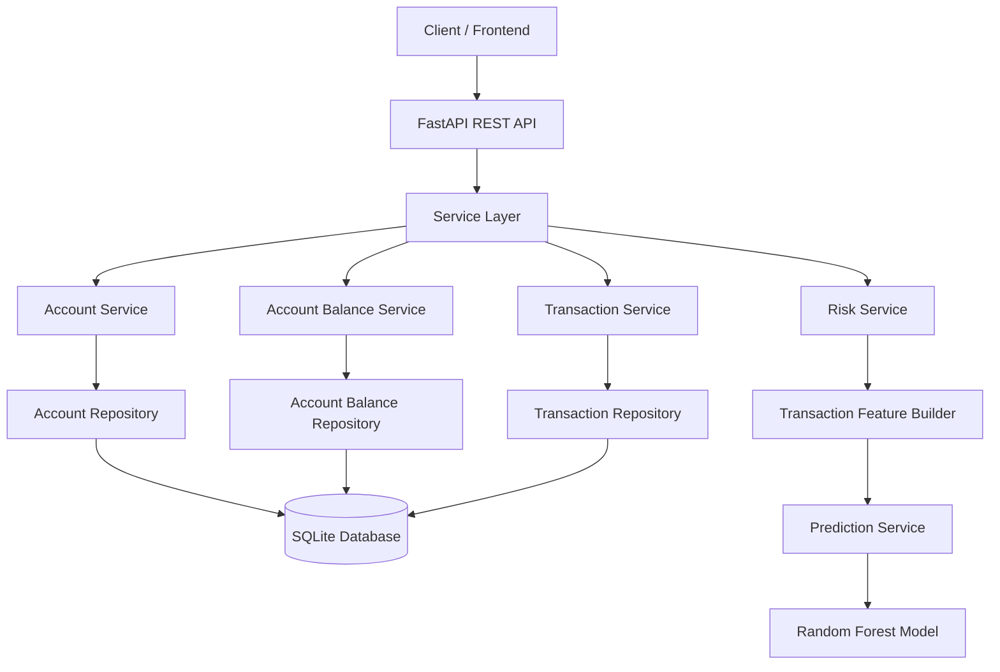
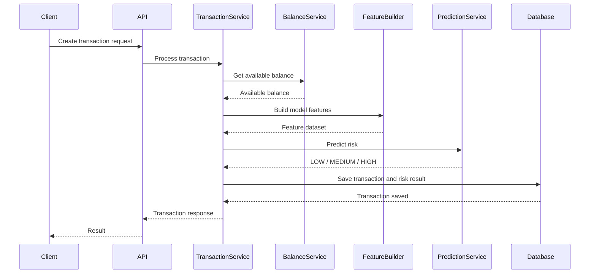
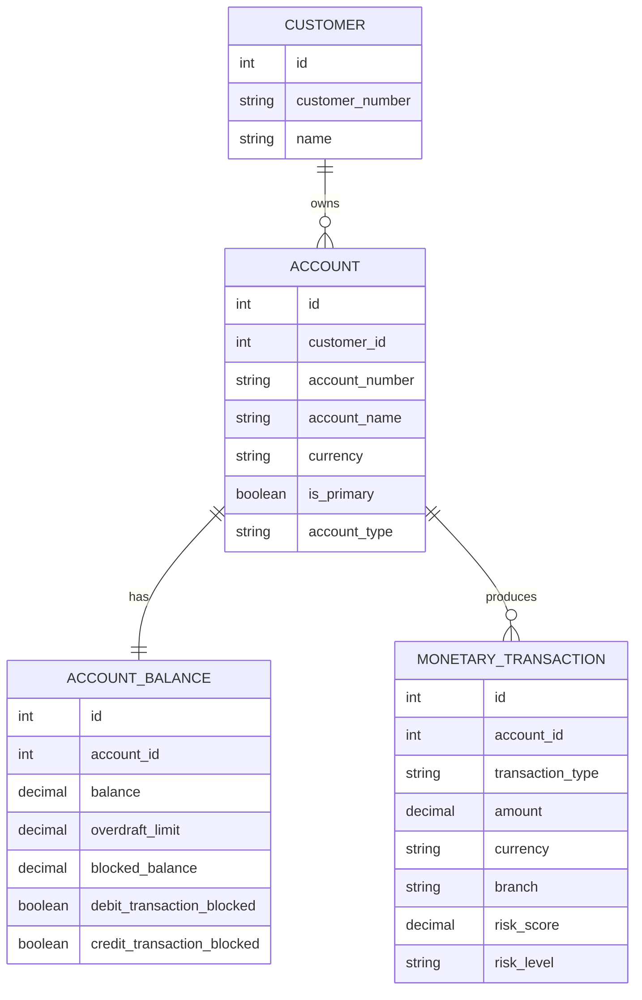
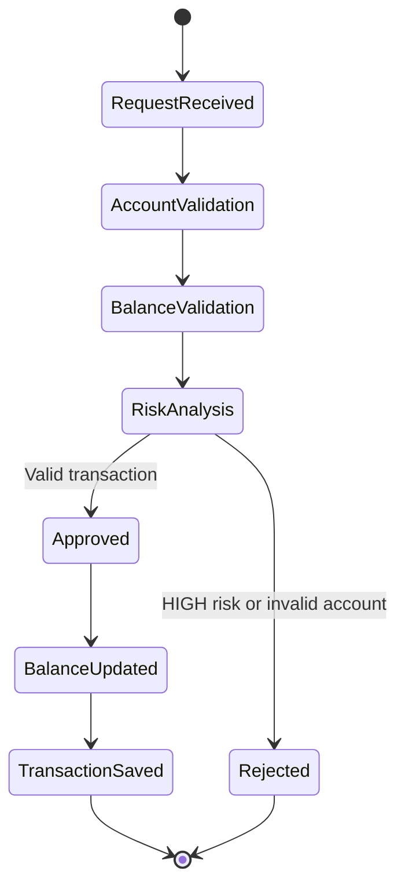

# 🏦 AI-Powered Banking Transaction Engine

<p align="center">
  <strong>Enterprise-style banking backend with AI-assisted transaction risk analysis</strong>
</p>

<p align="center">
  
  
  
  
  
</p>

---

## 📌 Project Overview

This project is an AI-powered banking backend developed with **Python**, **FastAPI**, **SQLAlchemy**, and **Scikit-learn**.

The architecture is inspired by enterprise Java and Spring Boot applications. It separates banking responsibilities into domain, repository, service, API, and AI layers.

The main goal is to build a banking transaction engine capable of:

* Managing bank accounts and balances
* Processing monetary transactions
* Calculating available balance
* Applying banking validation rules
* Predicting transaction risk levels
* Supporting future fraud detection capabilities

> The current machine learning model is trained with a small manually created dataset for educational and architectural purposes. It is not intended for real financial decision-making.

---

## ✨ Current Capabilities

| Module                 | Status | Description                                       |
| ---------------------- | -----: | ------------------------------------------------- |
| Account Management     |      ✅ | Account creation and account metadata             |
| Account Balance        |      ✅ | Balance, overdraft and blocked balance management |
| Available Balance      |      ✅ | Available balance calculation                     |
| Monetary Transaction   |      ✅ | Base transaction entity and persistence           |
| Rule-Based Risk Engine |      ✅ | Initial banking risk rules                        |
| Feature Builder        |      ✅ | Converts banking objects into model features      |
| ML Training Pipeline   |      ✅ | Trains and saves a Random Forest model            |
| Prediction Service     |      ✅ | Loads the model and predicts risk                 |
| Deposit                |     🚧 | Planned                                           |
| Withdraw               |     🚧 | Planned                                           |
| Transfer               |     🚧 | Planned                                           |
| Sundry Batch           |     🚧 | Planned                                           |

---

## 🧱 High-Level Architecture



---

## 🤖 AI Risk Analysis Flow



---

## 🧠 How the AI Module Works

The AI model currently uses the following transaction features:

| Feature              | Description                            |
| -------------------- | -------------------------------------- |
| `transaction_amount` | Amount of the transaction              |
| `available_balance`  | Usable balance of the account          |
| `blocked_balance`    | Amount currently blocked               |
| `debit_blocked`      | Whether debit transactions are blocked |

The model predicts one of the following risk levels:

```text
LOW
MEDIUM
HIGH
```

The model is trained using:

```python
model.fit(features, target)
```

After training, it is saved as:

```text
app/ai/transaction_risk_model.joblib
```

The `PredictionService` loads this file and uses it for new transaction predictions.

---

## 🏗️ Layered Project Structure

```text
app/
│
├── api/
│   └── REST API controllers
│
├── service/
│   ├── account_service.py
│   ├── account_balance_service.py
│   ├── monetary_transaction_service.py
│   └── risk_service.py
│
├── repository/
│   ├── account_repository.py
│   ├── account_balance_repository.py
│   └── monetary_transaction_repository.py
│
├── domain/
│   ├── account.py
│   ├── account_balance.py
│   ├── customer.py
│   ├── monetary_transaction.py
│   ├── account_type.py
│   └── account_status.py
│
├── schemas/
│   ├── account_request.py
│   └── monetary_transaction_request.py
│
├── ai/
│   ├── train_model.py
│   ├── prediction_service.py
│   ├── transaction_feature_builder.py
│   ├── test_prediction.py
│   └── transaction_risk_model.joblib
│
├── database.py
└── main.py
```

---

## 🏦 Banking Domain Model



---

## 💰 Available Balance Calculation

Available balance is calculated using:

```text
Available Balance
=
Current Balance
+
Overdraft Limit
-
Blocked Balance
```

When debit transactions are blocked, the available balance may be treated as zero depending on the business rule.

---

## 🛡️ Current Rule-Based Risk Engine

Before the machine learning layer is fully developed, the application also supports rule-based risk scoring.

Current rules include:

* Debit transactions are blocked
* Transaction amount exceeds available balance
* Transaction amount is unusually high
* Account has a blocked balance

Example scoring logic:

```text
Debit blocked                  +0.70
Amount exceeds available       +0.50
Amount greater than 100,000    +0.20
Blocked balance exists         +0.10
```

Risk classification:

|         Score | Level  |
| ------------: | ------ |
| `0.00 - 0.39` | LOW    |
| `0.40 - 0.74` | MEDIUM |
| `0.75 - 1.00` | HIGH   |

---

## 🔄 Planned Transaction Flow



---

## 💳 Planned Banking Operations

### Deposit

```text
Validate account
→ Increase account balance
→ Save transaction
→ Return transaction result
```

### Withdraw

```text
Validate account
→ Check debit block
→ Check available balance
→ Predict transaction risk
→ Decrease balance
→ Save transaction
```

### Transfer

```text
Validate source account
→ Validate target account
→ Predict risk
→ Decrease source balance
→ Increase target balance
→ Save debit and credit records
```

### Sundry Batch

```text
Read batch items
→ Validate each item
→ Execute accounting entries
→ Save transaction records
→ Generate batch result
```

---

## 🚀 Getting Started

### 1. Clone the repository

```bash
git clone <repository-url>
cd <repository-name>
```

### 2. Create a virtual environment

```bash
python -m venv .venv
```

### 3. Activate the environment

macOS / Linux:

```bash
source .venv/bin/activate
```

Windows:

```bash
.venv\Scripts\activate
```

### 4. Install dependencies

```bash
pip install fastapi uvicorn sqlalchemy pandas scikit-learn joblib
```

### 5. Train the risk model

```bash
python -m app.ai.train_model
```

### 6. Test a prediction

```bash
python -m app.ai.test_prediction
```

### 7. Start the application

```bash
uvicorn app.main:app --reload
```

### 8. Open Swagger UI

```text
http://127.0.0.1:8000/docs
```

---

## 🗺️ Development Roadmap

### Phase 1 — Core Banking

* [x] Domain entities
* [x] Repository layer
* [x] Service layer
* [x] Account balance management
* [x] Available balance calculation
* [x] Monetary transaction foundation
* [ ] Deposit operation
* [ ] Withdraw operation
* [ ] Transfer operation
* [ ] Transaction history

### Phase 2 — Banking Operations

* [ ] Sundry transaction
* [ ] Sundry batch execution
* [ ] Batch reversal
* [ ] Scheduled banking jobs
* [ ] Account statements
* [ ] Interest calculation

### Phase 3 — Artificial Intelligence

* [x] Feature builder
* [x] Training pipeline
* [x] Random Forest model
* [x] Prediction service
* [ ] Synthetic transaction dataset
* [ ] Fraud classification
* [ ] Model evaluation metrics
* [ ] Confusion matrix
* [ ] Feature importance analysis
* [ ] Explainable AI
* [ ] Model retraining pipeline

### Phase 4 — Production Readiness

* [ ] PostgreSQL
* [ ] Docker
* [ ] JWT authentication
* [ ] Redis
* [ ] Unit tests
* [ ] Integration tests
* [ ] Logging
* [ ] Global exception handling
* [ ] CI/CD pipeline
* [ ] Monitoring and health checks

---

## 🧪 Planned Testing Strategy

```text
Unit Tests
├── AccountService
├── AccountBalanceService
├── RiskService
└── PredictionService

Integration Tests
├── Repository tests
├── Database tests
└── FastAPI endpoint tests

AI Tests
├── Model loading
├── Prediction output
├── Feature validation
└── Model evaluation
```

---

## 🔮 Future Vision

The long-term goal is to transform this project into an enterprise-style AI banking platform supporting:

* AI-powered fraud detection
* Intelligent transaction risk scoring
* Rule engine and ML model comparison
* Customer transaction behavior analysis
* Suspicious transaction alerts
* Batch banking operations
* Explainable AI outputs
* Banking analytics dashboards
* Model monitoring and retraining

---

## ⚠️ Disclaimer

This project is created for software architecture, banking backend, and machine learning education.

It does not use real customer data and must not be used to make real financial, fraud, credit, or compliance decisions.

---

<p align="center">
  Built with Python, FastAPI and Machine Learning
</p>
